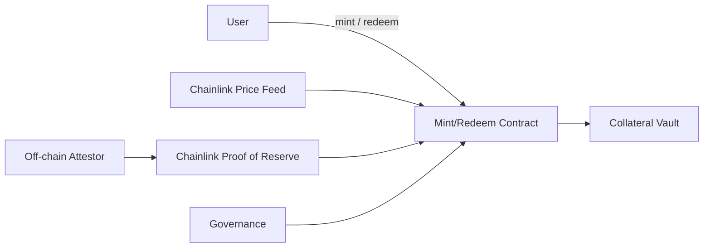
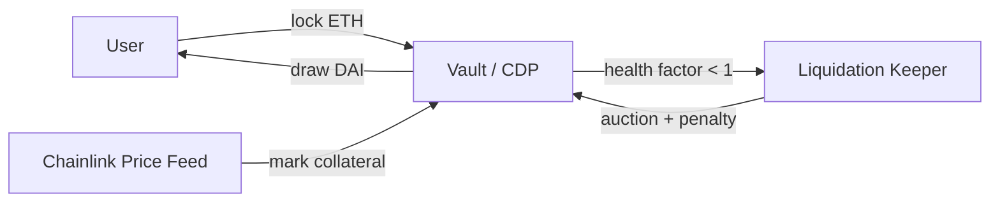

# What is a Stablecoin?

- A crypto token designed to hold a stable value against a reference asset (usually USD)
- Why they exist: settlement rail, unit of account, on/off-ramp, DeFi collateral
- **The peg problem**: market price must track the reference even under stress
- **Role of oracles**: on-chain contracts cannot see USD or off-chain reserves — Chainlink Price Feeds + Proof of Reserve supply that truth

---

# Types of Stablecoins

| Type | Examples | Backing | Key risk |
|---|---|---|---|
| Fiat-backed | USDC, USDT, PYUSD | 1:1 off-chain reserves, attested | Custodial / censorship |
| Crypto / CDP | DAI, LUSD, GHO | Over-collateralized on-chain vaults | Oracle & liquidation |
| Algorithmic | UST (failed), AMPL | Sister-token seigniorage | Death spiral |
| Commodity-backed | PAXG, XAUT | Vaulted gold 1:1 | Custodian |
| Hybrid / fractional | FRAX (v1 → frxUSD) | Mixed, now fully backed | Parameter risk |
| Delta-neutral synthetic | Ethena USDe | Spot long + perp short ≈ $1 | Funding rate / venue |

---

# Comparison: Trust, Efficiency, Scale, Risk

| Model | Trust assumption | Capital efficiency | Scalability | Dominant risk |
|---|---|---|---|---|
| Fiat-backed | Issuer + bank | High (1:1) | Very high | Custodian freeze |
| CDP | Smart contracts + oracle | Low (150%+) | Medium | Oracle / liquidation cascade |
| Algorithmic | Market reflexivity | Very high | Fragile | Reflexive collapse |
| Delta-neutral | CEX + perp market | High | Medium | Negative funding |

**Takeaway**: there is no free lunch — every stablecoin trades custodial trust for capital efficiency, or vice versa.

---

# Architecture: Reserve-Backed Stablecoin

- User deposits collateral; contract reads **Chainlink Price Feed** to value it
- Contract checks `totalSupply + mintAmount <= PoR.latestAnswer()` before minting
- **Proof of Reserve** is continuously refreshed from an off-chain attestor
- Governance sets parameters (fees, caps, pause) — without PoR + price feed, it's just trust-me math

---

# Architecture: CDP / Over-Collateralized (MakerDAO-style)

- User locks ETH in a vault and draws DAI up to `collateral * price / liquidationRatio`
- **Chainlink Price Feed** re-marks collateral each block; a stability fee accrues as interest
- If health factor drops below 1, a keeper triggers an auction with a liquidation penalty
- A PSM provides 1:1 USDC↔DAI swaps to anchor the peg during volatility

**Algorithmic vs CDP**: algo coins rely on reflexive demand for a sister token and can death-spiral; CDPs fail gracefully by auctioning real on-chain collateral.
